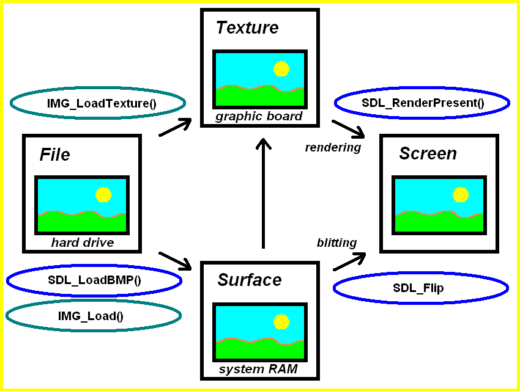
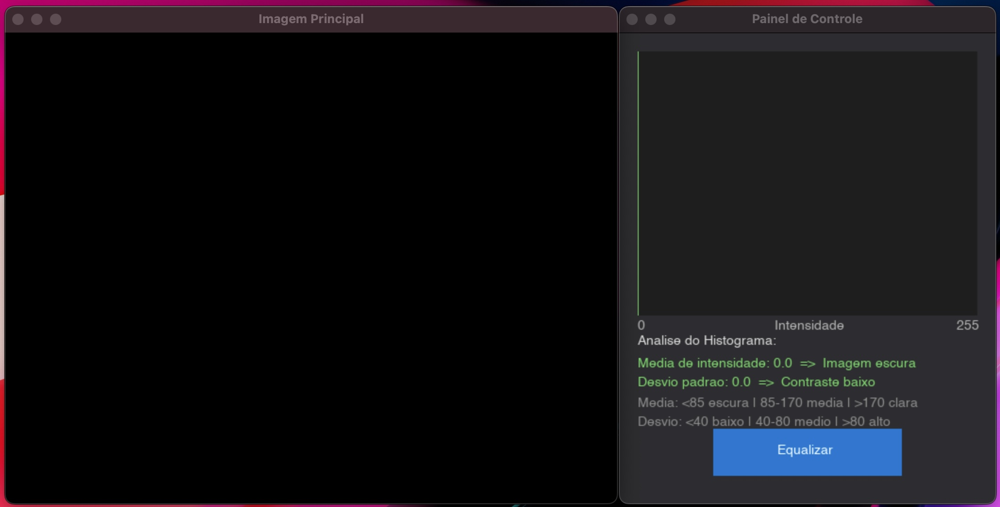
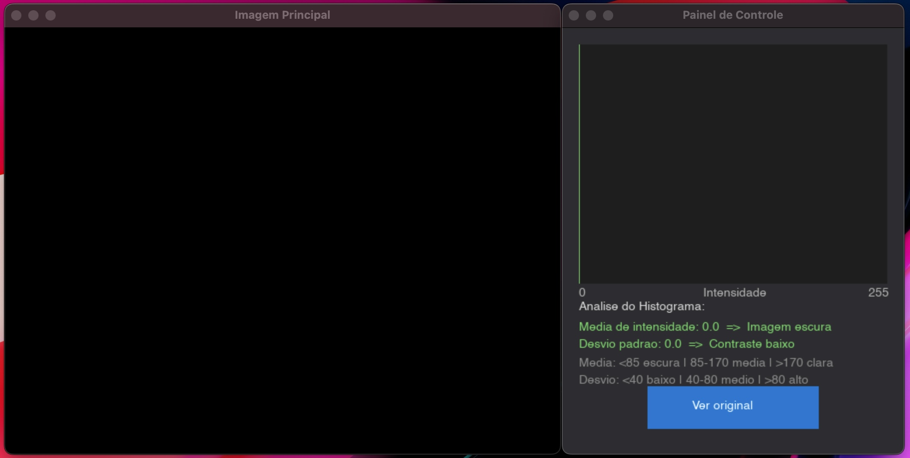
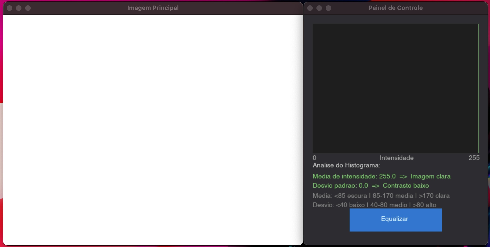
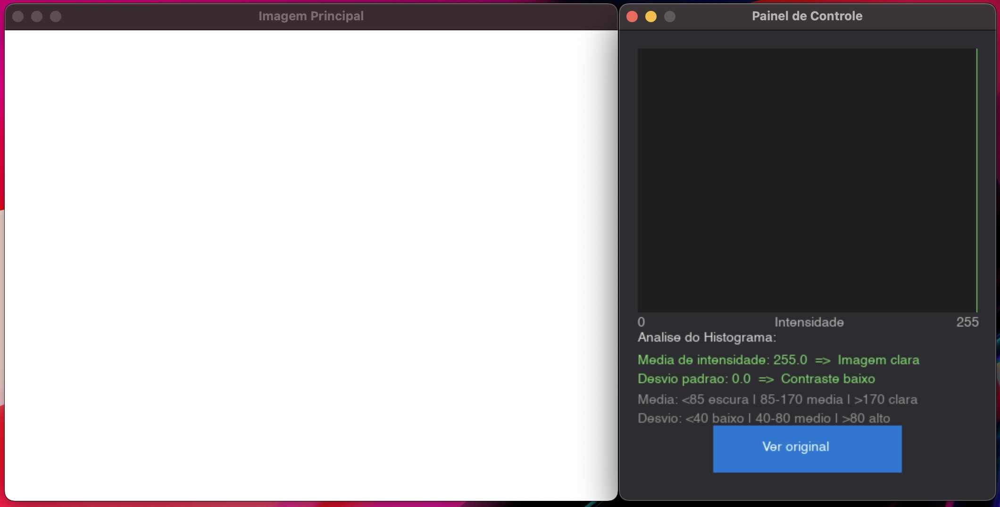
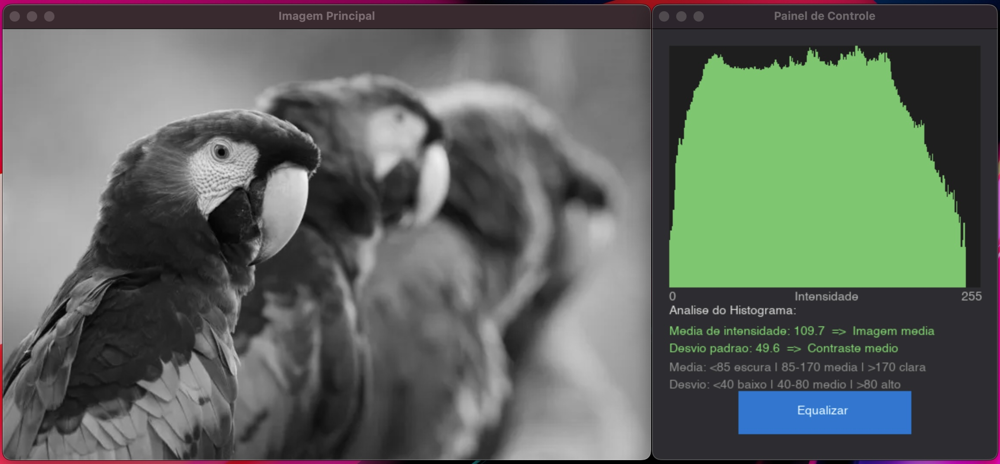
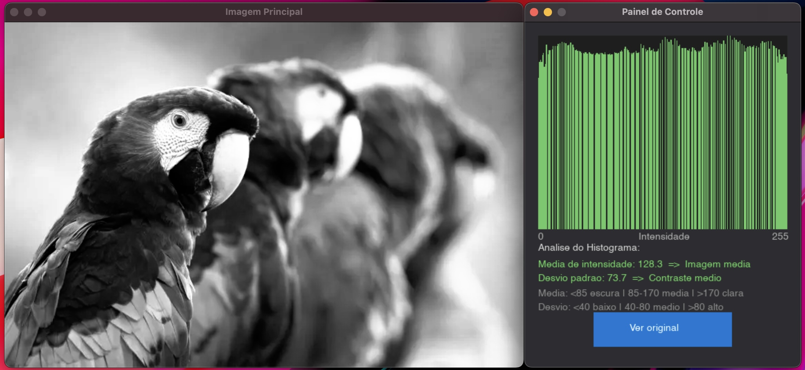
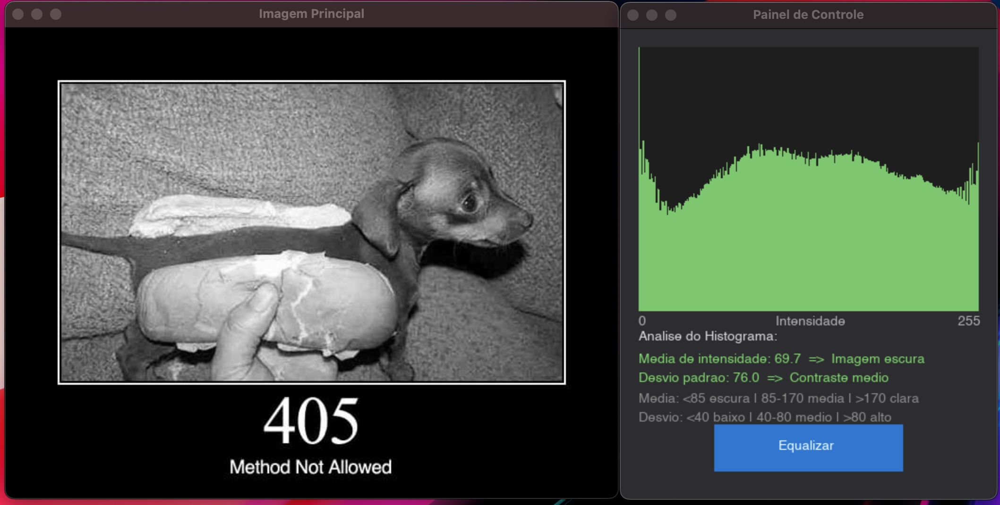
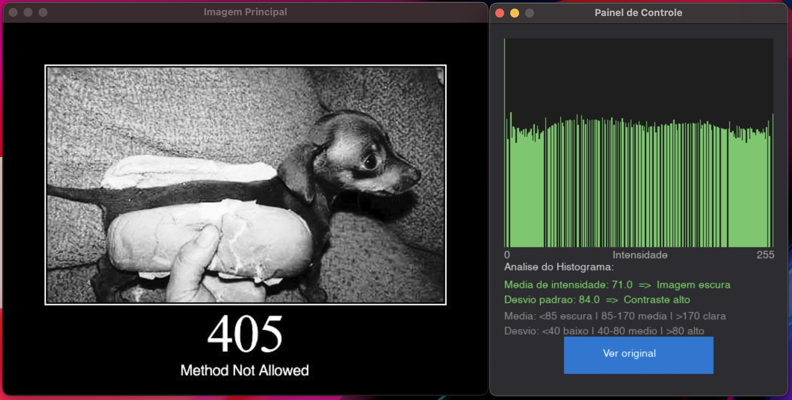

# Processador de Imagens SDL

## Integrantes do Grupo

- Bruna Aguiar Muchiuti - 10418358
- Gabriel Ken Kazama Geronazzo - 10418247
- Lucas Pires de Camargo Sarai - 10418013
- Jessica dos Santos Santana Bispo - 10410798

<br>

## Objetivo e funcionamento

Aplicação escrita em **C (C23)** que carrega uma imagem via linha de comando, converte-a automaticamente para escala de cinza, exibe o histograma de intensidades em tempo real e permite **equalizar** esse histograma com um único clique. A interface gráfica é renderizada com **SDL3**, SDL3\_image e SDL3\_ttf.
 
<br>

## Visão geral
 
O programa abre duas janelas SDL sincronizadas:
 
| Janela | Conteúdo |
|---|---|
| **Imagem Principal** | Exibe a imagem (original em grayscale ou equalizada) no tamanho real do arquivo. |
| **Painel de Controle** | Histograma logarítmico, métricas estatísticas calculadas e botão de ação. |

<br>
 
## Funcionalidades implementadas
 
### 1. Carregamento e normalização de formato
O módulo `image_loader` usa `IMG_Load` (SDL3\_image) para abrir o arquivo e em seguida converte a superfície bruta para o formato canônico `SDL_PIXELFORMAT_RGBA32` (4 bytes por pixel, ordem R-G-B-A). Isso garante que todos os algoritmos downstream operem sobre um layout de memória uniforme, independentemente do formato original (JPEG, PNG, etc.).

<br>
 
### 2. Conversão para escala de cinza (Método da Luminância)
Caso a imagem carregada não seja já grayscale, `convert_to_grayscale` percorre cada pixel e aplica a fórmula ponderada de luminância perceptual:
 
```
Y = 0.2125·R + 0.7154·G + 0.0721·B
```
 
Os pesos refletem a sensibilidade diferenciada do olho humano a cada canal de cor (maior sensibilidade ao verde, menor ao azul). O valor `Y` resultante é atribuído igualmente aos canais R, G e B, preservando o canal A intocado.

<br>
 
### 3. Cálculo do histograma
`calculate_histogram` itera sobre todos os pixels da superfície RGBA32 e acumula, num array de 256 inteiros, a frequência de cada nível de cinza (0–255). Como após a conversão R == G == B, basta ler o canal R para obter o valor de intensidade.

<br>
 
### 4. Análise estatística do histograma
`analyse_histogram` deriva duas métricas diretamente da distribuição de frequências:
 
- **Média de intensidade** — média ponderada dos níveis de cinza pelo número de pixels em cada nível.
- **Desvio padrão** — raiz da variância ponderada, usada como proxy de contraste global.
 
Com base nesses valores, a imagem é classificada automaticamente em:
 
| Métrica | Limiar | Classificação |
|---|---|---|
| Média | < 85 | Imagem escura |
| Média | 85–170 | Imagem média |
| Média | > 170 | Imagem clara |
| Desvio padrão | < 40 | Contraste baixo |
| Desvio padrão | 40–80 | Contraste médio |
| Desvio padrão | > 80 | Contraste alto |

<br>
 
### 5. Equalização de histograma (CDF + LUT)
`equalize_histogram` implementa o algoritmo clássico de equalização baseado na Função de Distribuição Acumulada (CDF):
 
1. Calcula o histograma atual.
2. Constrói o vetor CDF acumulando as frequências.
3. Localiza `cdf_min` — o primeiro valor não-nulo da CDF.
4. Mapeia cada nível `i` para um novo nível através da fórmula de normalização:
 
```
lut[i] = round( (cdf[i] - cdf_min) / (total_pixels - cdf_min) × 255 )
```
5. Aplica a LUT (Look-Up Table) a cada pixel da superfície in-place.
 
O resultado é uma redistribuição uniforme dos tons de cinza por todo o intervalo [0, 255], ampliando o contraste efetivo da imagem.

<br>
 
### 6. Toggle equalização / original
O estado `is_histogram_equalized` controla qual versão da imagem está visível. Ao clicar no botão, `toggle_histogram_equalization` restaura a superfície original a partir de `original_grayscale_surface` (cópia mantida em memória desde o carregamento) antes de re-aplicar ou remover a equalização. O histograma e as métricas são recalculados a cada transição.

<br>
 
### 7. Renderização do histograma (escala logarítmica)
O histograma é desenhado em escala logarítmica para evitar que picos estreitos com frequência muito alta escondam detalhes das demais barras:
 
```
altura_barra[i] = (log(freq[i] + 1) / log(freq_max + 1)) × altura_painel
```
 
Cada uma das 256 barras tem largura `painel_width / 256` pixels.

<br>
 
### 8. Salvar imagem processada
Pressionar `S` durante a execução exporta a superfície atual (equalizada ou grayscale original) para `output_image.png` via `IMG_SavePNG` da SDL3\_image.
 
<br>
 
## Arquitetura do código
 
```
SDL-Image-Processor/
├── src/
│   ├── main.c              # Ponto de entrada, loop principal (60 FPS)
│   ├── image_loader.c      # Carregamento e liberação de SDL_Surface
│   ├── image_processor.c   # Algoritmos de processamento de imagem
│   ├── ui_state.c          # Estado global da aplicação e análise estatística
│   ├── ui_view.c           # Renderização de todos os componentes visuais
│   ├── ui_controller.c     # Tratamento de eventos SDL (mouse, teclado)
│   ├── ui_components.c     # Definições de componentes de UI reutilizáveis
│   └── utils.c             # Funções auxiliares (FPS → delay, validação de extensão)
├── include/
│   ├── image_processor.h
│   ├── image_loader.h
│   ├── ui_state.h          # Structs ApplicationState, enums de classificação
│   ├── ui_view.h           # Struct ApplicationView, texturas e janelas
│   ├── ui_controller.h
│   ├── ui_components.h
│   └── utils.h
├── libs/SDL3/              # SDL3 pré-compilado para Windows (DLLs + headers)
├── CMakeLists.txt          # Build multiplataforma via CMake (submodules vendored)
└── Makefile                # Build direto para Windows com GCC
```
 
### Separação de responsabilidades
 
| Módulo | Responsabilidade |
|---|---|
| `image_processor` | Algoritmos puros sobre `SDL_Surface*` (sem conhecimento de UI) |
| `image_loader` | I/O e normalização de formato |
| `ui_state` | Estado centralizado; única fonte da verdade para a lógica |
| `ui_view` | Renderização stateless — recebe estado, devolve pixels na tela |
| `ui_controller` | Traduz eventos SDL em mutações de estado |
 
<br>

## Fluxo de execução
 
```
main(argc, argv)
 │
 ├─ SDL_Init(SDL_INIT_VIDEO)
 │
 ├─ init_ui_state()
 │    ├─ IMG_Load() + SDL_ConvertSurface(RGBA32)
 │    ├─ is_grayscale()? → convert_to_grayscale()
 │    ├─ SDL_DuplicateSurface()  ← cópia original preservada (permite reverter)
 │    └─ calculate_histogram() + analyse_histogram()
 │
 ├─ init_ui_view()
 │    ├─ Cria janela primária (dimensões da imagem)
 │    ├─ Cria janela secundária (400×500, posicionada à direita)
 │    └─ TTF_OpenFont() com fallback multiplataforma
 │
 └─ loop principal @ 60 FPS
      ├─ process_user_interactions()   ← eventos SDL
      ├─ render_ui_view()              ← desenha ambas as janelas
      └─ SDL_Delay(16ms)
```
 



> Fonte: https://freepascal-meets-sdl.net/rendering-image-files-with-any-format-sdl3_image/

<br>

## Contribuições
#### Bruna
Implementou a biblioteca TTF para escrever as mensagens que melhoraram a compreensão do projeto, com uma reestruturação
das funcionalidades de exibição dos resultados, além de documentar junto de Jessica o funcionamento do programa.

#### Gabriel
Organizou a estrutura do projeto e implementou as funcionalidades para exibição das telas, além de documentar a estruturação
do projeto.

#### Jessica
Documentou todo o funcionamento do projeto junto de Bruna, desde os objetivos iniciais até os resultados alcançados, complementando a documentação feita pelo Gabriel, participou nos testes durante todo o desenvolvimento do projeto

#### Lucas
Refatorou a inclusão das dependências para tornar o projeto mais leve e mais rápido para ser baixado,
além de documentar o processo de compilação e execução feito com o auxílio das ferramentas do VS Code.

<br>

## Colocando em funcionamento

### Windows: Atalho VS Code

Aperte `CTRL+SHIFT+P` e então selecione :

```bash
> Tasks: Run Task
```

Em seguida, selecione o comando adequado ao seu sistema operacional (Windows ou Linux), ex:

```bash
> Compilar e executar Windows (MinGW: mingw32-make -> main.exe)
```
<br>

### Linux
Conceda permissão de execução aos scripts (necessário apenas na primeira vez):

```bash
$ chmod +x run.sh debug.sh
```

Utilize o script run.sh para compilar no modo `Release` e executar o projeto:

```bash
$ ./run.sh <path/to/image.png>
```

Exemplo de uso:

```bash
$ ./run.sh ../images/405.jpg
```

Ou, para compilar no modo `Debug` com sanitizers habilitados:

```bash
$ ./debug.sh <path/to/image.png>
```

Exemplo de uso:

```bash
$ ./debug.sh ../../images/405.jpg
```

Ou, use atalho VS Code

## Resultados

### Imagens uniformes

#### Histograma
O histograma apresenta todos os pixels concentrados em um único nível de intensidade (0 ou 255). Isso indica ausência total de variação na imagem.
- Imagem branca → intensidades em 255 → imagem clara
- Imagem preta → intensidades em 0 → imagem escura
- Desvio padrão igual a zero → contraste inexistente
  
#### Equalização
A equalização não produz alterações visíveis. Como não há distribuição de intensidades, não existe informação para redistribuir.






---

### Imagem com boa distribuição

#### Histograma
Os níveis de intensidade estão distribuídos ao longo de toda a faixa (0–255).
- Média intermediária → imagem equilibrada (nem clara nem escura)
- Desvio padrão médio → contraste adequado
  
#### Equalização
A equalização redistribui levemente os níveis de intensidade, tornando a distribuição mais uniforme.

**Efeito:** 
- Pequeno aumento no contraste e melhor distinção entre tons.




---

### Imagem escura

#### Histograma
As intensidades estão concentradas em valores baixos.
- Média baixa → imagem escura
- Desvio padrão moderado → contraste limitado

#### Equalização
A equalização redistribui os níveis de intensidade ao longo de toda a faixa.

**Efeito:**
- A imagem se torna mais clara
- O contraste aumenta
- Detalhes antes pouco visíveis passam a ser perceptíveis




<br>

## Referências
- MATTHIAS. **Rendering Image Files with any format (SDL3_image) - Free Pascal meets SDL**. Disponível em: <https://freepascal-meets-sdl.net/rendering-image-files-with-any-format-sdl3_image/>. Acesso em: 27 mar. 2026.
- **Get Started with C++ and Mingw-w64 in Visual Studio Code**. Disponível em: <https://code.visualstudio.com/docs/cpp/config-mingw>.
- **ngnu.org**. Disponível em: <https://www.gnu.org/software/make/>.
- LIBSDL-ORG.**Simple DirectMedia Layer (SDL) Version 3.0**. Disponível em: <https://github.com/libsdl-org/SDL>.
- LIBSDL-ORG. **GitHub - libsdl-org/SDL_image: Image decoding for many popular formats for Simple Directmedia Layer**. Disponível em: <https://github.com/libsdl-org/SDL_image>.
- LIBSDL-ORG. **GitHub - libsdl-org/SDL_ttf: Support for TrueType (.ttf) font files with Simple Directmedia Layer**. Disponível em: <https://github.com/libsdl-org/SDL_ttf>.
- Materiais de Aula.
